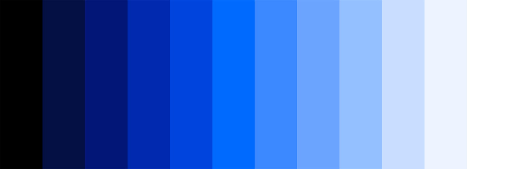

import HomepageTemplate from '../components/Homepage.js';
export default HomepageTemplate;

## A new design system for us

<PageDescription>

**Building tomorrow's INFORM experiences today.** The ELEVATE Design
    System empowers INFORM developer teams with web components, design tokens,
    and everything you need to create cohesive, accessible, and scalable
    INFORM-branded products that adapt to changing market needs.

</PageDescription>

<FeatureCard
    color="dark"
    href="/getting-started"
    title="Getting started"
    actionIcon="arrowRight"
    className="homepage-feature"
    >

<ArtDirection>

</ArtDirection>

</FeatureCard>

## The ELEVATE Ecosystem

**Everything you need to build exceptional INFORM experiences.**

<Row className="resource-card-group">
  <Column colMd={4} colLg={4} noGutterSm>
    <ResourceCard
      href="https://github.com/inform-elevate/elevate-core-ui"
      title="Core UI Library"
      subtitle="40+ Web Components, Storybook documentation"
      actionIcon="launch"
      aspectRatio="2:1"
      color="dark"
    />
  </Column>
  <Column colMd={4} colLg={4} noGutterSm>
    <ResourceCard
      href="https://github.com/inform-elevate/elevate-design-tokens"
      title="Design Tokens"
      subtitle="3-tier architecture: Primitive → Alias → Component"
      actionIcon="launch"
      aspectRatio="2:1"
      color="dark"
    />
  </Column>
  <Column colMd={4} colLg={4} noGutterSm>
    <ResourceCard
      href="https://github.com/inform-elevate/elevate-icons"
      title="Custom Icons"
      subtitle="SVG icons with TypeScript constants"
      actionIcon="launch"
      aspectRatio="2:1"
      color="dark"
    />
  </Column>
</Row>

## Built by Experts, For Teams

**A dedicated team of 9 designers and developers** led by Oliver Wrede and Thomas Weinert, working across INFORM's global offices to deliver enterprise-grade components.

<Row>
  <Column colMd={6} colLg={6}>
    <ResourceCard
      href="https://confluence.inform-software.com/x/5dM6D"
      title="Current Status"
      subtitle="Alpha 1 releases throughout 2025, 1.0 production ready November 2025"
      actionIcon="launch"
      aspectRatio="2:1"
      color="light"
    />
  </Column>
  <Column colMd={6} colLg={6}>
    <ResourceCard
      href="https://www.inform-software.design/"
      title="INFORM Corporate Design"
      subtitle="Brand guidelines and design principles for enterprise software"
      actionIcon="launch"
      aspectRatio="2:1"
      color="light"
    />
  </Column>
</Row>

## Community-Driven Innovation

ELEVATE thrives on **community input and collaborative contribution**. We actively synthesize feedback from product teams into reusable solutions, ensuring every improvement benefits the entire organization.

<Row>
  <Column colMd={12} colLg={8}>
    > *"We only include elements that have shared value across our product teams, following the mantra to include what is shared, omit what is not."*
    
    **Join the conversation** through MS Teams, Product Design Council, Figma, and community showcases.
  </Column>
</Row>
